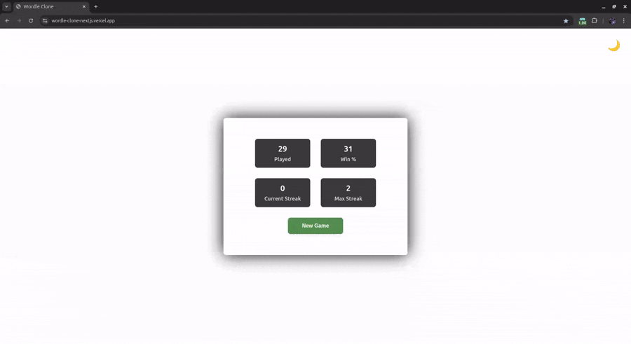
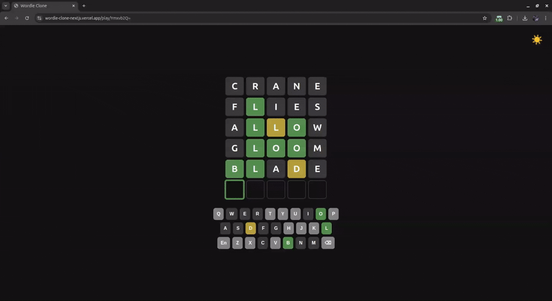
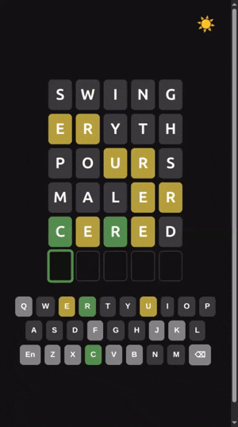
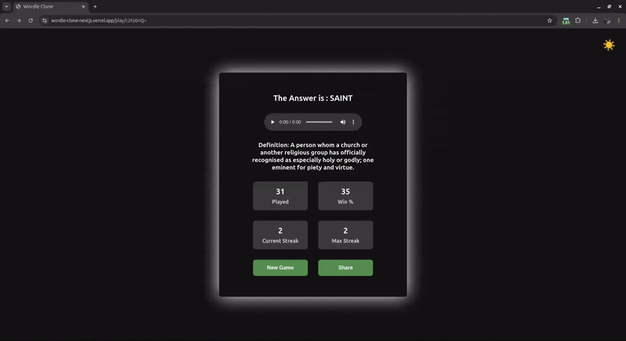
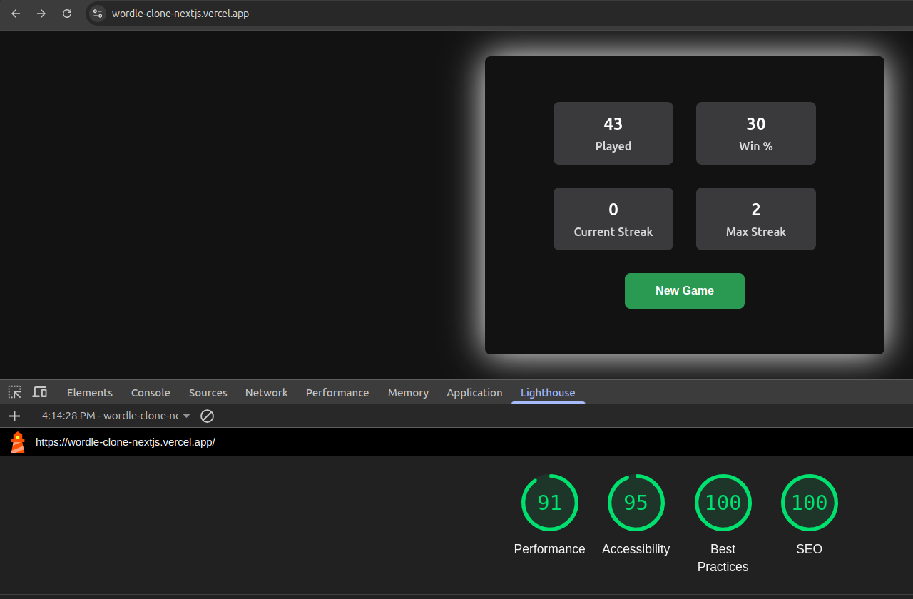
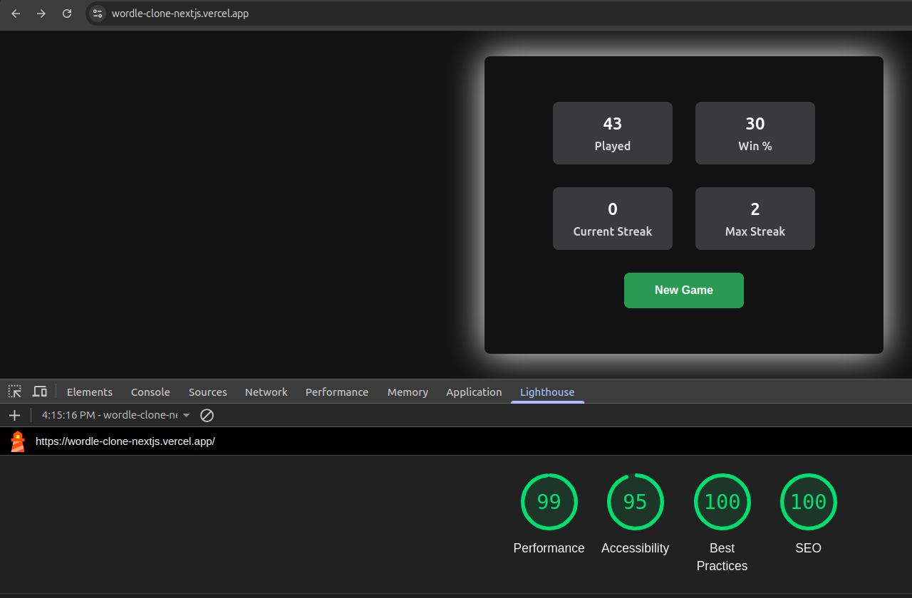

# 🔤 Wordle Clone – A Sleek, Full-Featured Word Game Built with Next.js

A modern, open-source reimagining of the classic Wordle game — built for speed, accessibility, and shareability.  
This project brings together smooth animations, real-time word definitions, local stat tracking, and shareable encrypted URLs — all powered by the **Next.js App Router**.

## 🚀 Live Demo

👉 [Play the Game](https://wordle-clone-nextjs.vercel.app/)

## ✨ Features

- 🎨 **Dark & Light Theme Toggle**  
  Automatically adapts to your system preference or lets you toggle manually.

- 📊 **Local Stats Tracking**  
  Tracks your wins, streaks, accuracy, and guess distribution — powered by Zustand and localStorage.

- 🎹 **Keyboard Navigation & Accessibility**  
  Fully playable with the keyboard, with ARIA labels and semantic HTML for screen reader support.

- 🎥 **Smooth Animations with Framer Motion**  
  Every tile flip, pop, and transition is powered by Framer Motion for a polished feel.

- 📚 **Word Definitions + Pronunciation + The Same Word List As Wordle**  
  See the meaning of each word after the game ends, and hear it with built-in audio playback. By default, it uses a free public word and definition API.

- 🔗 **Encrypted, Shareable Game URLs**  
  Each game generates a unique encrypted URL — challenge your friends with custom words.

- ⚡ **SSR + ISR with Next.js App Router**  
  Fast initial loads, SEO-friendly, and real-time word updates via server-side rendering.

- 📱 **Mobile Responsive**  
  Fully optimized for phones and tablets — play anywhere, anytime.

- 📋 **Emoji Share Button**  
  Share your results like classic Wordle — with color-coded emoji tiles and clipboard integration.

## 🛠️ Tech Stack

- **Frontend:** Next.js 14 (App Router), React 18
- **State Management:** Zustand
- **Animation:** Framer Motion
- **Routing & Rendering:** SSR, ISR, Dynamic Routing with Encrypted Params
- **Storage:** Local Storage via Zustand middleware
- **Utilities:** Custom hooks, audio playback, theming, clipboard API

## 🌟 Preview

### 🏠 Main Page



### 🖥️ Desktop Gameplay



### 📱 Mobile Gameplay



### 📊 Stats and Share Panel



## 📈 Lighthouse Performance

**Desktop**


**Mobile**


## 📦 Getting Started

```bash
# Clone the repo
git clone https://github.com/Clark-Castro/Wordle-Clone-NextJS.git
cd wordle-clone

# Install dependencies
npm install

# Run the development server
npm run dev
```

## 📝 License

MIT — free to use, fork, and build upon.

## Made with 🎯 focus and ☕ caffeine by Saeed.

## Contributions, issues, and stars welcome!
